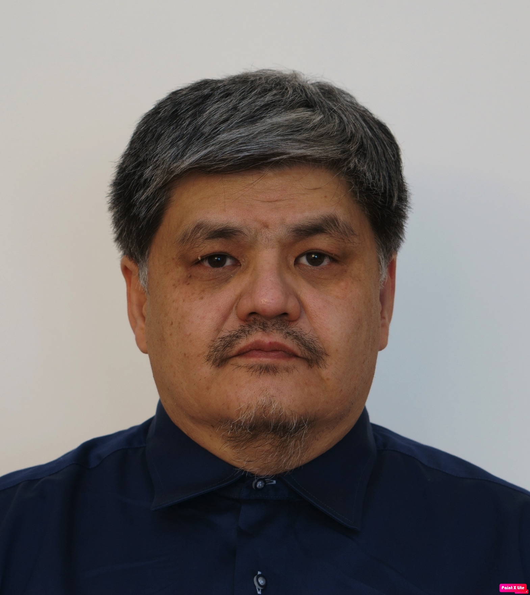

# Rashid Amanzholov
**Shortly about me:** 

***Computer Science is my work, my hobby and my life*** 

## My current projects  

1. **"Ecocity"** is a social project of ecologyc theme for Kazakhstan. This project includes [mobile application](https://ecocity-acb89.web.app/ "Ecocity Web Page") for [iOS](https://itunes.apple.com/WebObjects/MZStore.woa/wa/viewSoftware?id=1287938276&mt=8 "Appstore") and [Android](https://play.google.com/store/apps/details?id=kz.rescona.ecocity "Play market") that allows people improve knowledge about sorting garbage and finding the point of sorting centers. Was created a social network in [Facebook](https://www.facebook.com/ecoalakz "Facebook") and [Instagramm](https://www.instagram.com/e.coala "Instagramm") for community of people who are worried about the ecological future of their city, their country and all the  world.
I currently work for migrating this application to the new platform from Google: [Flutter/Dart](https://flutter.dev/ "Flutter.dev")  

2. **"Timmy"** (Russian name is "Успевайка (Uspevaika)") it is time managment [mobile application for Android](https://play.google.com/store/apps/details?id=kz.rescona.uspevayka "Play market") for kids and their parents. This application allows children to organize their schedule and their parents can help them to control their first steps in time managing. Therefore, it is necessary in our dynamic modern life.

## My old projects  

1. **LLC "Rescona Group"** - is a private company in Kazakhstan ["RESearch CONsulting and Analisys Group"](http://www.rescona.kz/index.html "www.rescona.kz"). This company founded by me since in 2002 for implementing and maintaining the core banking system "BISQUIT" ("QBIS") developed in Russia (ZAO "BIS") in banks of Kazakhstan. This system is based on products and technologies of [Progress Software (USA)](https://www.progress.com/ "Progress Software"). Responsobility of company include the implementation of banking system that was in adaptation and localisation of this product for government regulations; full enrollment implementation and maintain of localized parts of system; first line support for all other system modules. Under my leadership and direct involvement, this system was implimented in folow banks:
    * Sberbank of Russia in Kazakhstan
    * Bank "Astana"
    * Eximbank of Kazakhstan
    * DeltaBank
    
In 2016 my company started developing the mobile applications. In result created 2 application deiscribed above.  

2. From 1997 until 2000 during my work in Tax commity of Kazakhstan in roles of Deputy Chairman and Manager of IT department under my leadership and direct involvement was analised of IT systems of Tax commity, developed IT strategy, created specifications for developing and implementating new information system for Tax Managment named "INIS RK". Was created bidding documets for procurement by financing of World Bank.  

3. From 1990 until 1997 during my work in Bank "BankCenterCredit" in roles of Vice-President, Manager IT department, software engeneer and system engeneer under my leadership and direct involvement was developed a distributed multi-branch core banking system, which allowed the bank to carry out a currency change in Kazakhstan at a minimum of costs and allowed to introduce advanced technologies for customer service and automation of accounting operations of the bank.  

## My last certificates  
It is just for checking my skills and knoweledge in new technologies of software developing.

  
  
  
  
